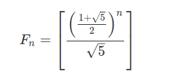

# Basic algorithms
c++ code of various alogiritms and it's variations are included in this section

## Nth Fibonacci Number - Various methods

### 1. Recursion
``` 
int fib(int n) {
    if (n <= 1)
        return n;
    return fib(n - 1) + fib(n - 2);
} 
```
### 2. Dynamic programming solution

``` 
int fib(int n) {
    int arr[n];
    arr[0]=0 , arr[1]=1;
    for(int i = 2; i <= n; i++){
        arr[i] = arr[i-1] + arr[i-2];
    }
    return arr[n];
} 
```
### 3. Direct formula for small values of 'n'



## GCD and LCM
GCD and LCM can be calculated by using **euclidean** equation.

### GCD
``` 
int gcd(int a, int b) {
  if(b==0)
    return a;
  else
    return gcd(b , a % b);
}
``` 

### LCM
LCM( a , b ) = ( a * b ) / gcd( a ,b )

## Pattern in Fibonacci series

For any integer m ≥ 2, the sequence **Fn mod n** is periodic. The period always
starts with 01 and is known as Pisano period.

For n = 2 , 011 (period = 3 )

For n = 3 , 01120221 (period = 8)

> F<sub>0</sub><sup>2</sup> + F<sub>1</sub><sup>2</sup> + · · · + F<sub>n</sub><sup>2</sup>  = F<sub>n</sub> * F<sub>n+1</sub>